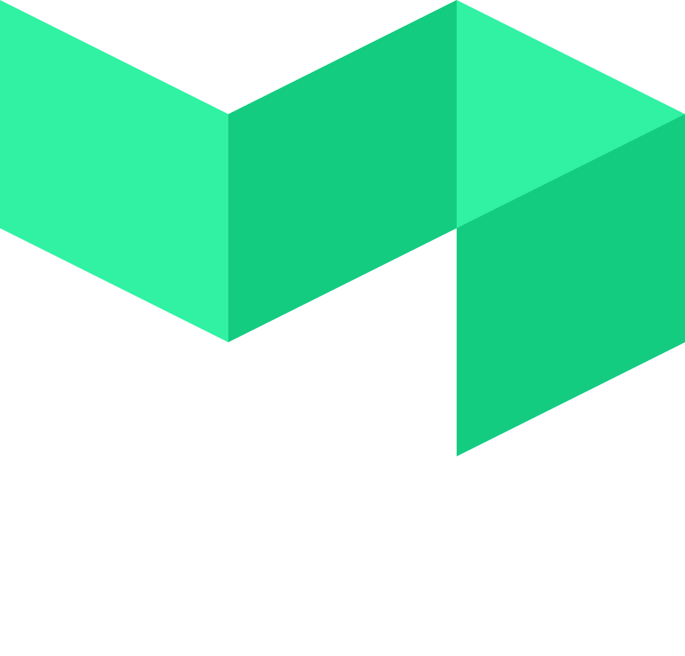

# Hi there, I'm Serafin 👨🏽‍💻

- I code (you may call me a Kotlin connoisseur)
- I've got a degree in Artificial Intelligence and Computer Science
- I work as a backend engineer
- I like plants 🪴
- I mostly use private repos in GitHub, but I thought I'd give you a landing page to hang out in. Make yourself home!

Here is a set of languages, tools and technologies I've used (in no particular order):

                  
